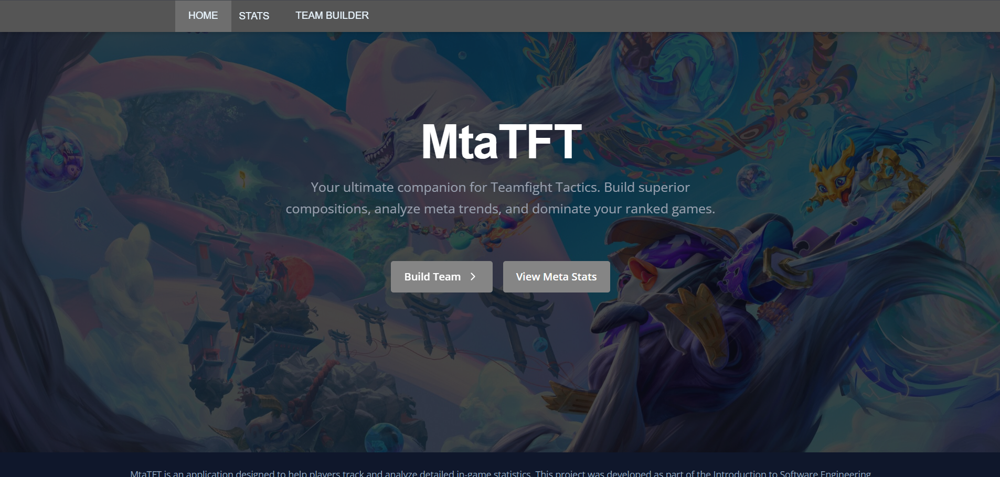
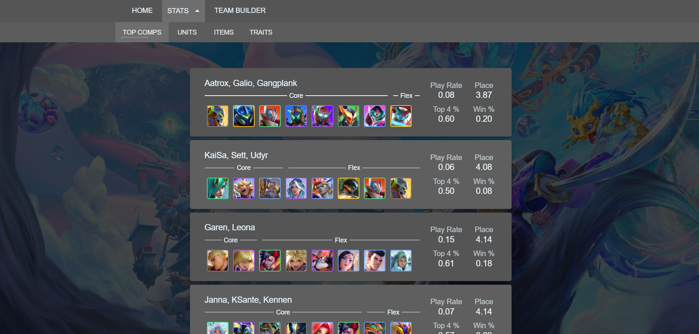
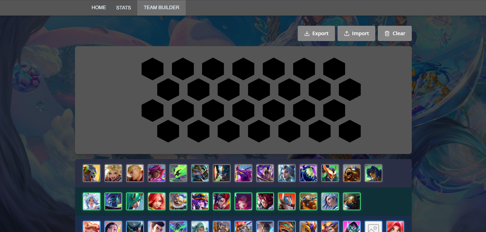
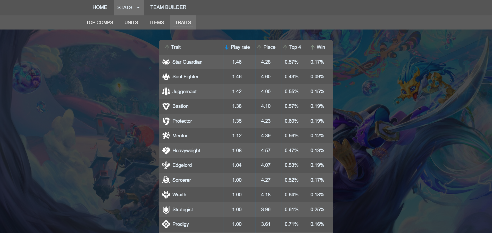
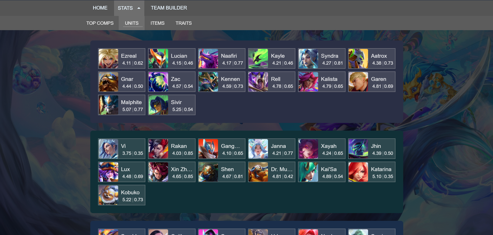
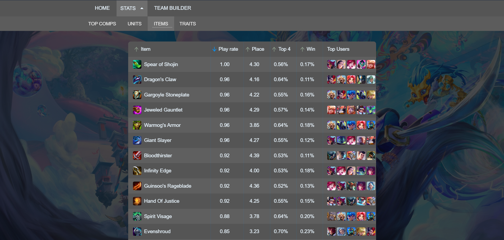

# MtaTFT - Teamfight Tactics Analytics Platform

**MtaTFT** is a comprehensive analytics platform for Teamfight Tactics (TFT) that empowers players to make data-driven decisions. The application provides in-depth statistical analysis of team compositions, units, items, and traits, helping players understand the current meta and optimize their gameplay strategies. The platform leverages **PCA (Principal Component Analysis)** and **HDBSCAN (Hierarchical Density-Based Spatial Clustering)** algorithms to process and analyze game data.

This project was developed as part of the **Introduction to Software Engineering** course at **VNU-HCM University of Science (HCMUS)**, demonstrating practical application of modern full-stack development principles, database design, and software engineering best practices.

---

## Table of Contents

- [Features](#-features)
- [Tech Stack](#-tech-stack)
- [Screenshots](#-screenshots)

---

## Features

- **Top Team Compositions**: Browse and analyze the most successful team compositions in the current meta
- **Unit Statistics**: Detailed unit performance metrics with filtering and sorting capabilities
- **Item Analysis**: Track item effectiveness, popularity, and optimal item holders
- **Trait Analytics**: Comprehensive trait statistics including pick rates, average placements, and win rates
- **Team Builder**: Interactive drag-and-drop team builder with real-time synergy calculations

---

## Tech Stack

### **Frontend**

- **Framework**: React 19.1.1 with TypeScript
- **Build Tool**: Vite 7.1.7
- **Styling**: TailwindCSS 4.1.17
- **UI Components**: Radix UI, Lucide React
- **Routing**: React Router DOM 7.9.6
- **State Management**: React Hooks
- **Drag & Drop**: @dnd-kit/core
- **Notifications**: React Hot Toast, Sonner

### **Backend**

- **Runtime**: Node.js with Express 5.1.0
- **Language**: TypeScript 5.9.3
- **Database**: PostgreSQL with Knex.js 3.1.0
- **API Client**: Axios 1.13.2
- **Validation**: Zod 4.1.13
- **CORS**: Enabled for cross-origin requests

### **Development Tools**

- **Package Manager**: npm/yarn
- **Dev Server**: tsx watch (backend), Vite (frontend)
- **Type Checking**: TypeScript strict mode
- **Linting**: ESLint with React plugins

---

## Screenshots

### Home Page

_Welcome to MtaTFT - Your comprehensive TFT analytics platform_

### Top Team Compositions

_Analyze the most successful team compositions in the current meta_

### Team Builder

_Interactive drag-and-drop team builder with real-time synergy calculations_

### Trait Analytics

_Comprehensive trait statistics and performance metrics_

### Unit Statistics

_Detailed unit performance data with advanced filtering_

### Item Analysis

_Track item effectiveness and optimal item holders_

---

**Built with ❤️ for the TFT community**
